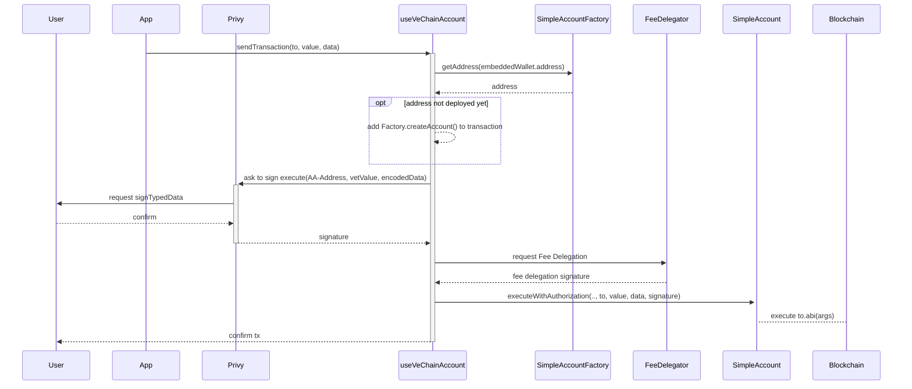

# PWA với Privy và Account Abstraction

## Mục tiêu

Mục tiêu của hướng dẫn này là:

- Triển khai mẫu của Privy để tạo một PWA chạy ứng dụng Next.js sử dụng ví tích hợp của họ.
- Điều chỉnh ứng dụng để ký và gửi giao dịch cho một ví Account Abstraction.

## Yêu cầu trước khi bắt đầu

Trước khi bắt đầu hướng dẫn này, bạn cần có kiến thức tốt về:

- **React**: Bạn cần biết cách lập trình với React, vì hướng dẫn này liên quan đến việc tạo PWA bằng Next.js, dựa trên React.
- **Hardhat**: Bạn cần quen thuộc với việc triển khai smart contract bằng Hardhat.
- **Fee Delegation**: Hiểu biết về fee delegation, đặc biệt trong ngữ cảnh của VeChain, là rất quan trọng để triển khai ví Account Abstraction.

## Privy

### Giới thiệu

Privy là một dịch vụ cung cấp các giải pháp xác thực mà hầu hết người dùng sử dụng hàng ngày để truy cập ví web3.

Privy xử lý việc tạo ví, bảo mật và các giao diện quản lý việc ký giao dịch hoặc tin nhắn.

### Thiết lập

Privy cung cấp hướng dẫn thiết lập trong một dự án mẫu trên GitHub:\
[https://github.com/privy-io/create-privy-pwa](https://github.com/privy-io/create-privy-pwa)

Các bước thực hiện như sau:

#### Clone Mẫu

```shell
npx degit privy-io/create-privy-pwa my-pwa-project
```

#### Cài đặt Dependencies

Chạy lệnh `npm install` để cài đặt các dependencies cần thiết:

```shell
cd my-pwa-project
npm install
```

#### Cấu hình Privy

Truy cập [https://privy.io](https://privy.io) để tạo một App mới.

Tạo file `.env` và thêm App ID bạn vừa tạo:

```shell
NEXT_PUBLIC_PRIVY_APP_ID=
```

### Khởi chạy Ứng dụng

Bạn có thể khởi chạy ứng dụng bằng lệnh `npm run dev` và có thể đăng nhập vào ứng dụng.

> **Lưu ý**: Khi phát triển, bạn nên sử dụng `ngrok` ([hướng dẫn](https://www.aleksandrhovhannisyan.com/blog/test-localhost-on-mobile/)), vì Privy sử dụng [crypto.subtle](https://developer.mozilla.org/en-US/docs/Web/API/Crypto/subtle) yêu cầu một kết nối bảo mật (`https`).

### Phương thức Đăng nhập

Bạn có thể bật hoặc tắt các phương thức đăng nhập mong muốn trong bảng điều khiển Privy tại: [https://dashboard.privy.io](https://dashboard.privy.io)

## Account Abstraction

### Giới thiệu

Account Abstraction là một tiêu chuẩn cho phép smart contract khởi tạo giao dịch, cung cấp một ví on-chain có thể thay thế tài khoản thuộc sở hữu bên ngoài (EOA).

Các dự án mẫu sử dụng tiêu chuẩn này có sẵn trên GitHub:

- [https://github.com/vechain/account-abstraction](https://github.com/vechain/account-abstraction)
- [https://github.com/eth-infinitism/account-abstraction](https://github.com/eth-infinitism/account-abstraction)

### Thiết lập

Để thực hiện hướng dẫn này, chúng ta sẽ sử dụng các hợp đồng account abstraction từ ví dụ `SimpleAccount` của dự án `eth-infinitism`.

Các hợp đồng cần triển khai bao gồm:

- [`core/EntryPoint.sol`](https://github.com/eth-infinitism/account-abstraction/blob/develop/contracts/core/EntryPoint.sol)
- [`samples/SimpleAccountFactory.sol`](https://github.com/eth-infinitism/account-abstraction/blob/develop/contracts/samples/SimpleAccountFactory.sol)
- [`samples/SimpleAccount.sol`](https://github.com/eth-infinitism/account-abstraction/blob/develop/contracts/samples/SimpleAccount.sol)

Để đơn giản hóa quy trình, bạn có thể sử dụng dự án đã được điều chỉnh trên GitHub tại:\
[https://github.com/vechain-energy/example-pwa-privy-account-abstraction/tree/main/account-abstraction-contracts](https://github.com/vechain-energy/example-pwa-privy-account-abstraction/tree/main/account-abstraction-contracts)

#### Clone Hợp đồng

```shell
git clone https://github.com/vechain-energy/docs-pwa-privy-account-abstraction-my-pwa-project.git
```

#### Cài đặt Dependencies

Chạy lệnh `npm install --legacy-peer-deps` để cài đặt các dependencies cần thiết:

```shell
cd docs-pwa-privy-account-abstraction/account-abstraction-contracts/
npm install --legacy-peer-deps
```

#### Cấu hình Mạng

Tạo một private key mới và tạo file `.env` để cấu hình key này làm deployer:

```shell
PRIVATE_KEY=0x...
```

Một cách đơn giản để tạo private key là sử dụng `openssl`:

```shell
echo "PRIVATE_KEY=0x$(openssl rand -hex 32)" > .env
```

Bạn cũng có thể điều chỉnh các tùy chọn liên quan đến mạng trong file `hardhat.config.ts`.

#### Triển khai Hợp đồng

Các script triển khai nằm trong thư mục `deploy/`. Bạn có thể kiểm tra để hiểu thêm.

Sử dụng plugin deploy của hardhat để triển khai các hợp đồng mẫu:

```shell
npx hardhat deploy --network vechain_testnet
```

Kết quả của lệnh trên sẽ hiển thị địa chỉ của các hợp đồng đã triển khai:

```shell
Generating typings for: 44 artifacts in dir: typechain-types for target: ethers-v6
Successfully generated 132 typings!
Compiled 46 Solidity files successfully (evm target: paris).
deploying "EntryPoint" (tx: 0x0b8df7637c4070630551b3c4701b2190e9882698d280a34b4a2632a9a7a3f0d5)...: deployed at 0x6cc1324CBeF466E61936792dD4D7C0F3eBe703d1 with 4042403 gas
==entrypoint addr= 0x6cc1324CBeF466E61936792dD4D7C0F3eBe703d1
deploying "SimpleAccountFactory" (tx: 0x73ead176308248932ff8b367db9c882a050e05b79ec18801fdaa261998d59744)...: deployed at 0x07AD1BF374251A5712D190196ED2fa58FC344caf with 2834689 gas
d54abce22180746e5f530a)...: deployed at 0x41Ea0cDa1471d70961bdc81bB9203a09cbf9B65e with 2503344 gas
```

Các địa chỉ triển khai và ABIs sẽ được lưu trong thư mục `deployments/vechain_testnet`.

Hãy ghi lại địa chỉ của `SimpleAccountFactory` đã triển khai để sử dụng sau. Trong ví dụ trên, địa chỉ là `0x41Ea0cDa1471d70961bdc81bB9203a09cbf9B65e`.

### Nền tảng: Chấp nhận Chữ ký Giao dịch

`SimpleAccount` chỉ cho phép truy cập từ chủ sở hữu hoặc hợp đồng EntryPoint.

Vì Privy không hỗ trợ mạng VeChain, chúng ta sẽ sử dụng tin nhắn ký xác thực. Thêm chức năng mới `executeWithAuthorization` để xác minh chữ ký cho giao dịch từ chủ sở hữu.

Bạn có thể thêm việc xác minh chữ ký vào `SimpleAccount.sol` bằng các thay đổi sau:

```solidity
import "@openzeppelin/contracts/utils/cryptography/EIP712.sol";
```

Gọi hàm EIP721 trong constructor bằng cách điều chỉnh định nghĩa:

```solidity
constructor(IEntryPoint anEntryPoint) EIP712("Wallet", "1") {
```

Thêm một hàm mới xác minh chữ ký và thực hiện giống như `execute`:

```solidity
/**
 * Thực hiện giao dịch (được gọi trực tiếp bởi chủ sở hữu hoặc qua EntryPoint) được ủy quyền thông qua chữ ký.

 * @param to Địa chỉ đích để gọi
 * @param value Giá trị gửi trong giao dịch
 * @param data Dữ liệu gửi kèm
 * @param validAfter Thời gian Unix sau thời điểm này chữ ký sẽ hợp lệ
 * @param validBefore Thời gian Unix trước thời điểm này chữ ký sẽ hợp lệ
 * @param signature Chữ ký kiểu type4
 */
function executeWithAuthorization(
    address to,
    uint256 value,
    bytes calldata data,
    uint256 validAfter,
    uint256 validBefore,
    bytes calldata signature
) external payable {
    require(block.timestamp > validAfter, "Authorization not yet valid");
    require(block.timestamp < validBefore, "Authorization expired");

    /**
     * Xác minh rằng chữ ký đã ký chức năng này.
     */
    bytes32 structHash = keccak256(
        abi.encode(
            keccak256(
                "ExecuteWithAuthorization(address to,uint256 value,bytes data,uint256 validAfter,uint256 validBefore)"
            ),
            to,
            value,
            keccak256(data),
            validAfter,
            validBefore
        )
    );
    bytes32 digest = _hashTypedDataV4(structHash);

    address recoveredAddress = ECDSA.recover(digest, signature);
    require(recoveredAddress == owner, "Invalid signer");

    // Thực hiện giao dịch
    _call(to, value, data);
}
```

---

### Tích hợp Account Abstraction vào Privy PWA

#### Cấu hình Account Abstraction và VeChain

Mở rộng file `.env` với các dòng sau:

```shell
NEXT_PUBLIC_AA_FACTORY=0x41Ea0cDa1471d70961bdc81bB9203a09cbf9B65e
NEXT_PUBLIC_NODE_URL=https://testnet.vechain.org
NEXT_PUBLIC_DELEGATOR_URL=https://sponsor-testnet.vechain.energy/by/90
```

- `NEXT_PUBLIC_AA_FACTORY`: Địa chỉ của `SimpleAccountFactory` đã triển khai.
- `NEXT_PUBLIC_NODE_URL`: URL của mạng VeChain bạn sử dụng.
- `NEXT_PUBLIC_DELEGATOR_URL`: Dịch vụ phí ủy quyền để thanh toán phí gas VTHO. Xem [vechain.energy](https://vechain.energy) để tạo hoặc [tự xây dựng](https://favo.gitbook.io/docs.vechain.org/start-building/tutorials/how-to-use-the-sdk/write-data/fee-delegation).

#### Cài đặt Dependency VeChain

Cài SDK VeChain để đơn giản hóa tương tác với mạng VeChain:

```shell
npm install  --save @vechain/sdk-core@1.0.0-beta.16 @vechain/sdk-network@1.0.0-beta.16
```
### `useVeChainAccount.tsx`

Một hook đã được chuẩn bị sẵn sẽ cung cấp khả năng kết nối với triển khai Account Abstraction.

Sao chép file [`useVeChainAccount.tsx`](https://github.com/vechain-energy/example-pwa-privy-account-abstraction/blob/main/my-pwa-project/lib/useVeChainAccount.tsx) vào thư mục `components/lib`.

---

### Nền tảng: Cách hook hoạt động

Hook thực hiện các bước sau:

1. Tạo một ví ngẫu nhiên để tương tác với blockchain, cung cấp một điểm đầu vào mạng nơi giao dịch có thể được chấp nhận.
2. Yêu cầu người dùng ký một thông báo kiểu `typed message` bằng ví tích hợp của Privy.
3. Nếu `SimpleAccount` chưa tồn tại, nó sẽ thêm một đoạn mã để triển khai một `SimpleAccount` mới.
4. Tạo giao dịch để tương tác với ví Account Abstraction.
5. Yêu cầu dịch vụ ủy quyền phí gas từ Fee Delegator để tránh việc nạp VTHO cho ví ngẫu nhiên.
6. Gửi giao dịch lên mạng VeChain.
7. Trả về ID giao dịch.

Quy trình trực quan được mô tả như sau:



---

### Thêm `VeChainAccountProvider`

Thêm `VeChainAccountProvider` vào `pages/_app.tsx` để bao bọc các thành phần ứng dụng.

`VeChainAccountProvider` là một React Context provider có chức năng:

1. Tạo một `ThorClient` mới để kết nối với mạng VeChain.
2. Xác định địa chỉ của ví Privy tích hợp.
3. Tải địa chỉ `SimpleAccount` từ `SimpleAccountFactory` thông qua địa chỉ Privy của người dùng.
4. Xuất địa chỉ, một hàm để gửi giao dịch, và một số thông tin chung về mạng/kết nối.

File sau khi chỉnh sửa sẽ trông như sau:

```tsx
import type { AppProps } from 'next/app'
import Meta from '@/components/meta'
import '@/styles/globals.css'
import { PrivyProvider } from '@privy-io/react-auth'
import { VeChainAccountProvider } from '@/lib/useVeChainAccount'

const App = ({ Component, pageProps }: AppProps) => {
	return (
		<PrivyProvider
			appId={process.env.NEXT_PUBLIC_PRIVY_APP_ID as string}
			config={{
				loginMethods: ['sms', 'apple', 'google'],
				embeddedWallets: {
					createOnLogin: 'all-users',
				},
			}}
		>
			<Meta />
			<VeChainAccountProvider
				nodeUrl={process.env.NEXT_PUBLIC_NODE_URL as string}
				delegatorUrl={process.env.NEXT_PUBLIC_DELEGATOR_URL as string}
				accountFactory={process.env.NEXT_PUBLIC_AA_FACTORY as string}
			>
				<Component {...pageProps} />
			</VeChainAccountProvider>
		</PrivyProvider>
	)
}

export default App
```

---

### Sử dụng `useVeChainAccount`

Nhập hook `useVeChainAccount` vào `pages/embedded-wallet.tsx` và gọi nó trong component:

```tsx
const vechain = useVeChainAccount()
```

---

### Hiển thị Địa chỉ

Địa chỉ được xuất từ hook `useVeChainAccount` là địa chỉ mà các giao dịch sẽ được thực hiện từ đó trong tương lai.

Thêm đoạn mã sau vào `embedded-wallet.tsx` để hiển thị địa chỉ tài khoản:

```tsx
<Section>
    <p className='text-md mt-2 font-bold uppercase text-gray-700'>
        Your VeChain Address
    </p>
    <textarea
        value={vechain.address}
        className='mt-4 h-12 w-full rounded-md bg-slate-700 p-4 font-mono text-xs text-slate-50 disabled:opacity-25'
        rows={1}
        readOnly
    />
</Section>
```

---

### Cấu hình Gọi Kiểm tra

Để kiểm tra tương tác, thay thế hành vi chuyển khoản kiểm tra hiện tại bằng lệnh gọi `vechain.sendTransaction`.

Thay thế hàm `onTransfer` trong `embedded-wallet.tsx` bằng đoạn mã sau:

```tsx
const onTransfer = async () => {
    if (!vechain.address) return
    try {
        setTxIsLoading(true)
        const _txHash = await vechain.sendTransaction({
            to: recipientAddress as `0x${string}`,
            value: parseEther('0.004'),
        })
        setTxHash(_txHash)
    } catch (e) {
        console.error('Transfer failed with error ', e)
        setTxIsLoading(false)
    }
}
```

---

### Kiểm tra PWA

Mở hai terminal để chạy ứng dụng và tạo endpoint HTTPS công khai:

- Chạy `npm run dev` để khởi chạy ứng dụng PWA.
- Chạy `ngrok http 3004` để khởi chạy proxy ngrok và lấy địa chỉ công khai bảo mật.

Truy cập trình duyệt:

- Mở địa chỉ chuyển tiếp từ `ngrok`.
- Đăng nhập bằng tài khoản mạng xã hội của bạn.
- Chuyển đến menu `Embedded Wallet`.

---

### Nạp tiền vào Ví VeChain

Truy cập [faucet.vecha.in](https://faucet.vecha.in/) để yêu cầu VET trên TestNet và gửi 1 VET vào địa chỉ VeChain hiển thị trong PWA của bạn.

---

### Kiểm tra Giao dịch

Trong PWA, nhập địa chỉ hợp lệ cho việc chuyển khoản và kiểm tra chức năng Transfer. Một hộp thoại sẽ mở ra yêu cầu ký giao dịch. Sau khi ký, `SimpleAccount` sẽ chuyển `0.004 VET` đến địa chỉ đã nhập.

---

### Tương tác với Smart Contracts

Để tương tác với các smart contract khác, `sendTransaction` chấp nhận các tham số `to`, `data`, và `value` giống như các hàm tương tự.

Ví dụ:

```tsx
const _txHash = await vechain.sendTransaction({
    to: '0x8384738C995D49C5b692560ae688fc8b51af1059',
    value: 0,
    data: {
        abi: [{
            "inputs": [],
            "name": "increment",
            "outputs": [],
            "type": "function"
        }],
        functionName: "increment",
        args: []
    },
})
```

---

### Ẩn Xác nhận Giao dịch

Ký tin nhắn hoặc giao dịch có thể phức tạp và gây trở ngại cho người dùng thông thường. Để giảm bớt ma sát, bạn có thể tắt hộp thoại xác nhận trong bảng điều khiển Privy tại `Embedded Wallets > Add confirmation modals`.

---

### Kết luận

Trong bài viết này, chúng ta đã tạo cách hỗ trợ VeChain trong dự án demo Privy bằng cách tạo Account Abstraction Factory làm nguồn tương tác. 

Dự án mẫu có thể tìm thấy tại: [docs-pwa-privy-account-abstraction-my-pwa-project](https://github.com/vechain-energy/docs-pwa-privy-account-abstraction-my-pwa-project). 

Bạn có thể phát triển thêm dựa trên dự án mẫu này hoặc tùy chỉnh quy trình của riêng bạn.
